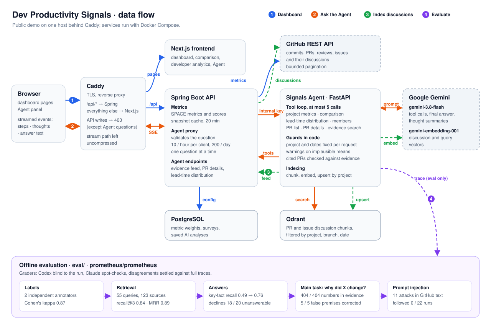

# Dev Productivity Signals

Dev Productivity Signals is a local developer analytics demo. The dashboard uses synthetic data by default. **Signals Agent** can answer questions about a selected GitHub project using bounded metric tools and a manually refreshed evidence index.

This repository has a new history and includes no deployment credentials or company environment configuration. The local example file contains empty placeholders; keep your actual `.env` file private.

## How data flows



1. **Dashboard.** Caddy sends pages to Next.js and `/api/*` to Spring Boot, which reads GitHub with bounded
   pagination (or synthetic demo data), scores SPACE metrics and caches snapshots for 20 minutes. PostgreSQL
   keeps metric weights, surveys and saved AI analyses. The public demo rejects API writes.
2. **Ask the Agent.** Spring validates the question and rate-limits it (10 per client per hour, 200 per day,
   one at a time), then forwards it to the Python Signals Agent with an internal key. Gemini chooses up to 5
   tool calls: Spring metric, comparison, lead-time and PR endpoints, and a Qdrant search over PR and issue
   discussions. The project and dates are fixed by the request, implausible means carry warnings, and cited
   PRs are checked against the evidence. Steps, thought summaries and the answer stream back as server-sent
   events.
3. **Index discussions.** Run manually per project, branch and date range: the Agent reads discussions
   through Spring from GitHub, splits and embeds them with `gemini-embedding-001` and stores them in Qdrant.
4. **Evaluate.** Offline, on `prometheus/prometheus`: retrieval against labels from two independent
   annotators, answers against key facts, the main "why did this metric change?" task by checking each
   answer against the tool evidence it received, and prompt injection planted in GitHub text. See
   [eval/README.md](eval/README.md).

## Components

- Next.js dashboard for project, team, member, and comparison views.
- Spring Boot API for metrics, GitHub integration, and AI analysis.
- Optional Python Signals Agent and Qdrant evidence index.
- PostgreSQL for local persistence.

Metrics describe observed activity and configured scoring rules. They do not establish that a score measures productivity or that a GitHub discussion caused a metric change. GitHub indexing and pagination are bounded, so Agent answers may have incomplete evidence.

## Run locally

Install Docker with Compose. Copy `.env.example` to `.env` and set a unique `POSTGRES_PASSWORD`:

```sh
cp .env.example .env
docker compose up -d --build
```

Open `http://localhost:3001`. The API listens on `http://localhost:8087`. Local ports are bound to the loopback interface.

To use Signals Agent, set `AGENT_ENABLED=true` and provide `GITHUB_API_TOKEN`, `GEMINI_API_KEY`, and a random `AGENT_INTERNAL_KEY` of at least 32 characters in `.env`:

```sh
docker compose --profile agent up -d --build
```

Select a real GitHub project, then populate its evidence index following [the Signals Agent guide](agent/README.md). Index refresh is manual. The Agent does not read PostgreSQL directly and does not index source code, saved AI analyses, or productivity scores.

## Verification

Run the backend tests from `backend/` with `./mvnw test`. Run the Agent tests from `agent/` with `PYTHONPATH=. python -m unittest discover -s tests`. The existing tests check selected behaviors; they are not a cross-project accuracy evaluation.

## Live demo

The demo is available at [signals.lizheng.cc](https://signals.lizheng.cc/ja). It serves synthetic dashboard data in read-only mode. Data-changing API requests are blocked except GitHub project lookup and Signals Agent questions. The public Agent uses a fresh evidence index and anonymous GitHub API access; answers may have limited coverage until public evidence is indexed. Agent questions are limited to 10 per hour per client and 200 per day for the whole demo (`AGENT_RATE_LIMIT_PER_CLIENT_PER_HOUR`, `AGENT_RATE_LIMIT_PER_DAY`), and one question runs at a time.

For a self-hosted deployment, set `DEMO_DOMAIN` and a unique `POSTGRES_PASSWORD` in a private `.env`, then run `docker compose -f docker-compose.prod.yml up -d --build`. The production stack exposes only Caddy on ports 80 and 443; database, backend, and frontend remain within the Docker network. Do not commit `.env`.

No automatic remote deployment workflow is included.
